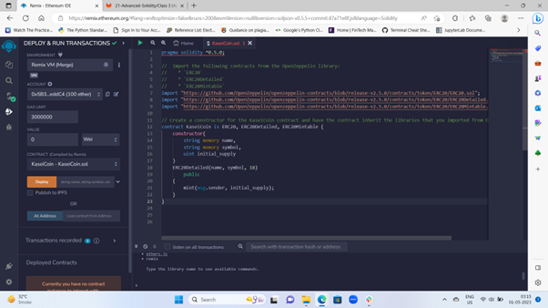
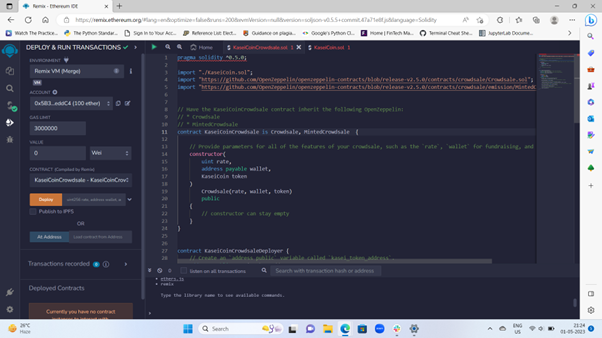
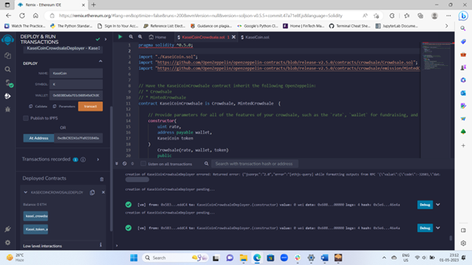

# Module-21-challenge

### The main task for this assignment was to develop a monetary system for a new colony based on blockchain technology. Hence, a new cryptocurrency named KaseiCoin is developed using smart contracts.
---

## Evaluation Evidence

>This png file clearly depicts that KaseiCoin smart contract has been succesfully compiled.

---

>The KaseiCoinCrowdsale contract has also been compiled succesfully as per the requirement.

---

>Lastly, the KaseiCoinCrowdsale contract has been successfully deployed and can be interacted with.
